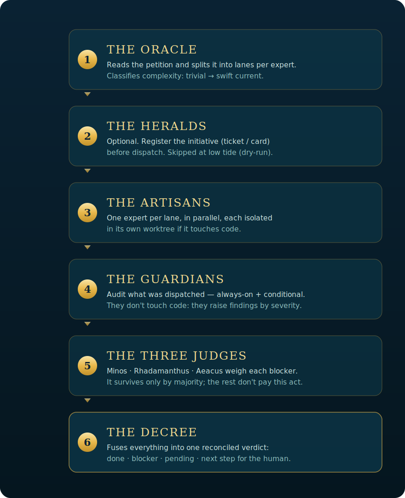

<p align="center">
  
</p>

<p align="center">
  <a href="./LICENSE"></a>
  
  
  
  <a href="./README.md"></a>
</p>

<p align="center"><b>One natural-language petition enters the city. One Decree comes out.</b><br>
A config-driven multi-agent orchestrator for Claude Code — single file, serverless. The <b>engine</b> (<code>atlantis.mjs</code>) is zero-dep; the optional <a href="./slack/">Slack bridge</a> brings its own dependencies.</p>

---

## The pain it solves

A single agent doing **everything** saturates: the context window is working memory, and once it fills the agent drifts out of character, mixes concerns, and lets through mistakes that **nobody audits**. And if you split the work across agents by hand, you end up rewriting routing, parallelism, and verification **in every project**.

## What it's for

So a request is split across **specialists with fresh context**, **audited** by always-on guardians, **false blockers filtered out** by an adversarial trial, and everything **reconciled into one verdict** — by configuring a single block, without touching the engine. The human still decides the irreversible (merge, deploy, publish): Atlantis prepares and reconciles, it doesn't ship to production.

## How

Six acts, each with its name and its craft. Config-driven; runs with Claude Code's `Workflow` tool.

<p align="center">
  
</p>

| Act | In the city | What it actually does |
|---|---|---|
| 1 · **The Oracle** | reads the petition | an LLM router splits it into *lanes* per expert + classifies complexity (trivial → swift current) |
| 2 · **The Heralds** | announce | *(optional)* register the initiative (ticket/card) before dispatch |
| 3 · **The Artisans** | build | one expert agent per lane, in parallel; the ones that touch code isolate in their own worktree (audit/report-only and low-tide lanes run with no side-effects) |
| 4 · **The Guardians** | watch | audit what was dispatched — always-on + conditional. They don't touch code |
| 5 · **The three Judges** | sentence | **Minos · Rhadamanthus · Aeacus** weigh each 🔴; it survives only by majority |
| 6 · **The Decree** | proclaims | fuses everything into one verdict: ✅ done · 🔴 blocker · 🟡 pending · → next step |

### Three currents so you don't overpay

- **Swift current.** If the Oracle marks the petition trivial and it maps to ≤1 lane, it resolves inline: no Heralds, no worktrees, no Guardians.
- **Low tide (dry-run).** To test the city without it doing anything real: the Artisans run in report mode (zero worktrees/branches/commits/issues) and only say what they *would* do.
- **The Judges' trial.** A single-voice Guardian can over-severize or hallucinate a 🔴 that stops the human. Before the Decree, each 🔴 passes through the three Judges (repro/authority/severity lenses) that try to refute it; it survives only by majority. 🟡/⚪ findings don't pay this, and with zero 🔴 the act is skipped entirely.

### Sample Decree

What the city returns in `synthesis` for a request that crossed two lanes:

```
🔱 DECREE — "add a share button to the pet detail view"

🔴 BLOCKERS (confirmed by the Judges)
- The share endpoint leaks the owner's internal id in the URL (agent-security, 3/3 votes).
  → can't merge until it uses the public slug.

✅ DONE
- agent-front: branch feat/share-button — button + share sheet in CaseDetail (3 files), validation green.
- agent-back: branch feat/share-endpoint — POST /share route with rate-limit (2 files), validation green.

🟡 PENDING
- Share copy isn't in brand voice yet (non-blocking).
- No test for the endpoint's rate-limit.

→ NEXT STEP (human)
Switch the URL to the public slug, review both branches, and open the PRs. The copy 🟡 can ship in a follow-up.
```

🟡/⚪ findings and refuted 🔴 are reported separately; only 🔴 that survived the trial appear as blockers.

---

## Requirements

- **Claude Code** with the `Workflow` tool available.
- One or more **subagents** (the Artisans) in `.claude/agents/`. Every `profile` and every `guard.profile` must exist as an agent there — see [`examples/agents/agent-docs.md`](./examples/agents/agent-docs.md).
- The **engine** (`atlantis.mjs`) needs no servers, dependencies, or build: it's **a single file**. The optional [Slack bridge](./slack/) is a long-running server with its own dependencies.

## Usage

1. **Clone** this repo (or copy `atlantis.mjs` into your repo).
2. **Define your roster** by editing the `CONFIG` block atop [`atlantis.mjs`](./atlantis.mjs). `Workflow` scripts run sandboxed (no filesystem), so the config **lives inline** in the script — [`atlantis.config.example.mjs`](./atlantis.config.example.mjs) is the *shape* to paste there.
3. **Run the city** with the `Workflow` tool, passing your petition as `args`:

```js
Workflow({ scriptPath: 'atlantis.mjs', args: 'fix the back button on the map' })
```

The return struct of the **standard current** carries `{ request, dryRun, complexity, lanes, kickoff, results, failed, guards, verifiedBlockers, refutedBlockers, unjudgedBlockers, synthesis }`.

There are **other return shapes** depending on which exit the city takes (discriminate by these fields):

| Exit | When | Shape |
|---|---|---|
| **Standard** | the normal case | the struct above |
| **Swift current** | trivial petition mapping to ≤1 lane | `{ request, fastPath: true, complexity, lane, answer, note }` |
| **No lanes** | no artisan applies | `{ request, dryRun, complexity, lanes: [], note }` |
| **Error** | missing petition/roster, or the Oracle failed | `{ error }` (`'no-request'` / `'no-profiles'` / `'oracle-failed'`) |

A programmatic consumer (e.g. the Slack bridge) must check `fastPath`/`error` before reading `synthesis`/`guards`.

Low tide:

```js
Workflow({ scriptPath: 'atlantis.mjs', args: { request: 'your request', dryRun: true } })
```

### Config anatomy

```js
const CONFIG = {
  // (1) Artisans: key = agent name in .claude/agents/, value = what it covers.
  profiles: {
    'my-front': 'frontend: components, navigation, visual bugs',
    'my-back':  'backend: API routes, domain, persistence',
    'my-docs':  'documentation: guides, READMEs, specs',
    'my-sec':   'security: auth, rules, PII, prompt-injection',
  },
  // (2) Guardians: run AFTER the Artisans, audit what was produced.
  guards: [
    { profile: 'my-sec',  lens: 'SECURITY', focus: 'auth, rules, PII', always: true },
    { profile: 'my-flow', lens: 'FLOW',     focus: "the journey doesn't contradict itself",
      when: (lanes) => lanes.some(l => l.profile === 'my-front') },
  ],
  // (3) Optional: Heralds (kickoff registration) before dispatch.
  kickoff: { profile: 'my-kickoff', instructions: 'create the card and the branch convention' },
  // (4) Optional: execution discipline prepended to each Artisan.
  dispatchPreamble: 'If you touch code: worktree off fresh origin/main, validate green, commit on a branch, do NOT open a PR.',
}
```

Everything else (swift current, parallelism, adversarial trial, Oracle/Decree prompts) Atlantis brings. Full commented shape in [`atlantis.config.example.mjs`](./atlantis.config.example.mjs); a real 14-Artisan roster in [`examples/example.config.mjs`](./examples/example.config.mjs).

---

## Why not orchestrate by hand?

Claude Code already ships the bricks: subagents (the `Task`/`Agent` tool) and `Workflow` for deterministic fan-out. Atlantis **doesn't replace them, it uses them** — an opinionated recipe on top:

| | Bare subagent (`Task`) | Raw `Workflow` | **Atlantis** |
|---|---|---|---|
| Decides **which** expert takes it | you, by hand | you, in the script | **the Oracle** over your roster |
| Runs several in parallel | yes, but you fire/coordinate them by hand | yes, you wire it | yes, **one Artisan per lane** |
| Post-work safety net | no | whatever you write | **always-on + conditional Guardians** |
| Stops false 🔴 | no | no | **the three Judges** (majority) |
| Reconciles into one verdict | no | whatever you write | **the Decree** |
| Per-project configurable | — | rewrite the script | **one `CONFIG` block** |

Rule of thumb: one expert + one task → just call a subagent. Atlantis wins when the request **crosses several concerns** and you want something to **audit and reconcile** the result — without rewriting the orchestration each time.

---

## Atlantis on Slack

Atlantis can **live in Slack** as one more collaborator: you talk to it in a channel or thread, it runs the city, and the Decree returns to the thread. A reply in the same thread **continues the task** with live context. See [`slack/`](./slack/).

> **Privacy boundary (by design).** The Slack-side Atlantis is only **triggered** by what's said **in Slack**, plus its own scheduled **daily reports**: it doesn't hook into your local sessions or mirror your terminal. But that boundary is about **what activates it**, not **what a run can access**: Claude Code runs with `cwd` in your repo and, depending on `--permission-mode`, can read host files outside the repo if an allowlisted user asks. Treat the allowlist (`SLACK_ALLOWED_USERS`) as the real trust boundary, and keep the default `plan` (read-only) unless you trust everyone. See [`slack/`](./slack/) to harden it.

---

## Troubleshooting

| Symptom | Likely cause | Fix |
|---|---|---|
| A `profile` or `guard.profile` "doesn't exist" / the lane drops without running | the CONFIG agent isn't in `.claude/agents/` | every `profile` and every `guard.profile` must exist as an agent. See [`examples/agents/agent-docs.md`](./examples/agents/agent-docs.md). |
| The script won't start / `Workflow` doesn't respond | the `Workflow` tool isn't available in your Claude Code | enable `Workflow` (see Requirements); without it Atlantis won't run. |
| A "low tide" still created worktrees/branches/commits (a REAL run) | `dryRun` was lost: the harness may deliver `args` as a **string** (serialized JSON), so `{ request, dryRun }` arrives as text | Atlantis already normalizes + parses a string `args` before reading `dryRun`. Verify `dryRun: true` in the **return struct** before trusting it was a dry run. |

---

## Structure

| File | What it is |
|---|---|
| [`atlantis.mjs`](./atlantis.mjs) | The orchestrator. Not touched to use it — configured from outside. |
| [`atlantis.config.example.mjs`](./atlantis.config.example.mjs) | Commented example config (the shape of the `CONFIG` block). |
| [`examples/example.config.mjs`](./examples/example.config.mjs) | A real roster (14 Artisans + Guardians) as a case study. |
| [`examples/agents/agent-docs.md`](./examples/agents/agent-docs.md) | The shape of a `.claude/agents/` agent. |
| [`slack/`](./slack/) | The bidirectional Slack bridge + the daily report. |
| [`assets/`](./assets/) | Visual identity (banner, logo, diagram). |

## Contributing

Issues and PRs welcome. Keep the engine **project-agnostic** (all specificity lives in the user's `CONFIG`) and respect the city's voice. See [`CONTRIBUTING.md`](./CONTRIBUTING.md).

## Credits & license

Atlantis draws on the **orchestrator → swappable pool of experts → verification** pattern that various multi-agent systems have been popularizing, and takes it to a small, serverless piece living inside your repo. Licensed [MIT](./LICENSE).

<p align="center"><sub>🔱 Atlantis · one petition in, one Decree out.</sub></p>
