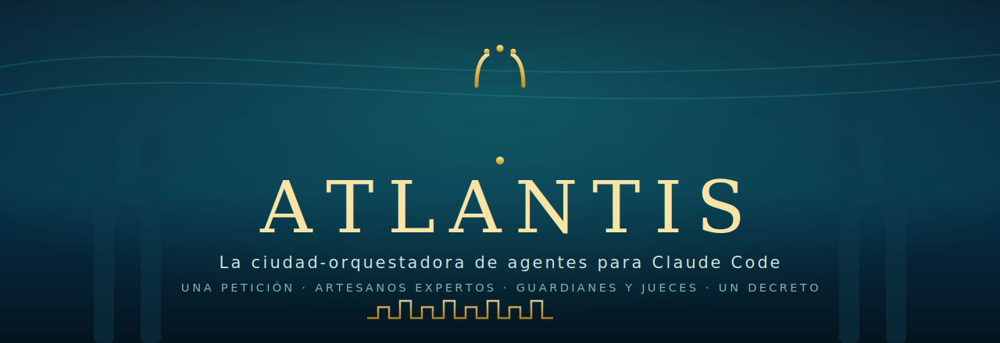
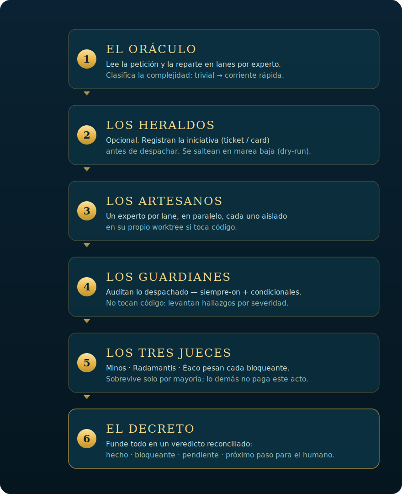

<p align="center">
  
</p>

<p align="center">
  <a href="./LICENSE"></a>
  
  
  
  <a href="./README.es.md"></a>
</p>

<p align="center"><b>One natural-language petition enters the city. One Decree comes out.</b><br>
A config-driven multi-agent orchestrator for Claude Code — single file, serverless, zero dependencies.</p>

---

## The pain it solves

A single agent doing **everything** saturates: the context window is working memory, and once it fills the agent drifts out of character, mixes concerns, and lets through mistakes that **nobody audits**. And if you split the work across agents by hand, you end up rewriting routing, parallelism, and verification **in every project**.

## What it's for

So a request is split across **specialists with fresh context**, **audited** by always-on guardians, **false blockers filtered out** by an adversarial trial, and everything **reconciled into one verdict** — by configuring a single block, without touching the engine. The human still decides the irreversible (merge, deploy, publish): Atlantis prepares and reconciles, it doesn't ship to production.

## How

Six acts, each with its name and its craft. Config-driven; runs with Claude Code's `Workflow` tool.

<p align="center">
  
</p>

| Act | In the city | What it actually does |
|---|---|---|
| 1 · **The Oracle** | reads the petition | an LLM router splits it into *lanes* per expert + classifies complexity (trivial → swift current) |
| 2 · **The Heralds** | announce | *(optional)* register the initiative (ticket/card) before dispatch |
| 3 · **The Artisans** | build | one expert agent per lane, in parallel, each isolated in its worktree |
| 4 · **The Guardians** | watch | audit what was dispatched — always-on + conditional. They don't touch code |
| 5 · **The three Judges** | sentence | **Minos · Rhadamanthus · Aeacus** weigh each 🔴; it survives only by majority |
| 6 · **The Decree** | proclaims | fuses everything into one verdict: ✅ done · 🔴 blocker · 🟡 pending · → next step |

### Three currents so you don't overpay

- **Swift current.** If the Oracle marks the petition trivial and it maps to ≤1 lane, it resolves inline: no Heralds, no worktrees, no Guardians.
- **Low tide (dry-run).** To test the city without it doing anything real: the Artisans run in report mode (zero worktrees/branches/commits/issues) and only say what they *would* do.
- **The Judges' trial.** A single-voice Guardian can over-severize or hallucinate a 🔴 that stops the human. Before the Decree, each 🔴 passes through the three Judges (repro/authority/severity lenses) that try to refute it; it survives only by majority. 🟡/⚪ findings don't pay this, and with zero 🔴 the act is skipped entirely.

---

<<<<<<< HEAD
## Requirements and Compatibility

### A. Claude Code (Original)
- **Claude Code** with the `Workflow` tool available.
- One or more **subagents** (the Artisans) in `.claude/agents/`. Every `profile` and every `guard.profile` must exist as an agent there — see [`examples/agents/agent-docs.md`](./examples/agents/agent-docs.md).
- No servers, dependencies, or build. Atlantis is **a single file** (`atlantis.mjs`).

### B. Gemini / Antigravity (Native Support)
Atlantis is also natively compatible with the **Antigravity (Gemini)** ecosystem, leveraging its **Customizations (Skills)** and parallel subagent orchestration.
- **Antigravity environment** active.
- Local skill configuration detailed under [`integrations/antigravity/`](./integrations/antigravity/).

## Usage

### With Claude Code

=======
## Requisitos y Compatibilidad

### A. Claude Code (Original)
- **Claude Code** con la herramienta `Workflow` disponible.
- Uno o más **subagentes** (los Artesanos) definidos en `.claude/agents/`. Cada `profile` y cada `guard.profile` de tu config debe existir como un agente ahí — ver [`examples/agents/agent-docs.md`](./examples/agents/agent-docs.md) para la forma.
- Nada de servidores, dependencias ni build. Atlantis es **un solo archivo** (`atlantis.mjs`).

### B. Gemini / Antigravity (Soporte Nativo)
Atlantis también es compatible de forma nativa con el ecosistema de **Antigravity (Gemini)**, utilizando su sistema de **Personalizaciones (Skills)** y la orquestación paralela de subagentes.
- **Entorno Antigravity** activo.
- Configuración de la skill local detallada en [`integrations/antigravity/`](./integrations/antigravity/).

## Uso

### Con Claude Code


1. **Cloná** este repo (o copiá `atlantis.mjs` a tu repo).
2. **Definí tu roster** editando el bloque `CONFIG` arriba de [`atlantis.mjs`](./atlantis.mjs). Los scripts de `Workflow` corren sandboxeados (sin filesystem), así que la config **vive inline** en el script. [`atlantis.config.example.mjs`](./atlantis.config.example.mjs) es la *forma* a pegar ahí.
3. **Corré la ciudad** con la herramienta `Workflow`, pasando tu petición como `args`:
>>>>>>> origin/main

```js
Workflow({ scriptPath: 'atlantis.mjs', args: 'fix the back button on the map' })
```

The return struct carries `{ request, dryRun, complexity, lanes, results, guards, verifiedBlockers, refutedBlockers, synthesis }`. Low tide:

```js
Workflow({ scriptPath: 'atlantis.mjs', args: { request: 'your request', dryRun: true } })
```

Define your roster in the `CONFIG` block atop [`atlantis.mjs`](./atlantis.mjs). Commented shape: [`atlantis.config.example.mjs`](./atlantis.config.example.mjs). A real 14-Artisan roster: [`examples/example.config.mjs`](./examples/example.config.mjs).

### With Gemini / Antigravity

1. Copy the `.agents/` folder to the root of your project.
2. Configure your roster in `integrations/antigravity/atlantis.config.json`.
3. Ask the agent in the chat: *"Use Atlantis for [your request]"*.
4. To run the CLI simulation harness in your terminal:
     ```bash
     node integrations/antigravity/atlantis-harness-gemini.mjs "Your development request"
     ```

---

## Why not orchestrate by hand?

Claude Code already ships the bricks: subagents (the `Task`/`Agent` tool) and `Workflow` for deterministic fan-out. Atlantis **doesn't replace them, it uses them** — an opinionated recipe on top:

| | Bare subagent (`Task`) | Raw `Workflow` | **Atlantis** |
|---|---|---|---|
| Decides **which** expert takes it | you, by hand | you, in the script | **the Oracle** over your roster |
| Runs several in parallel | no | yes, you wire it | yes, **one Artisan per lane** |
| Post-work safety net | no | whatever you write | **always-on + conditional Guardians** |
| Stops false 🔴 | no | no | **the three Judges** (majority) |
| Reconciles into one verdict | no | whatever you write | **the Decree** |
| Per-project configurable | — | rewrite the script | **one `CONFIG` block** |

Rule of thumb: one expert + one task → just call a subagent. Atlantis wins when the request **crosses several concerns** and you want something to **audit and reconcile** the result — without rewriting the orchestration each time.

---

## Atlantis on Slack

Atlantis can **live in Slack** as one more collaborator: you talk to it in a channel or thread, it runs the city, and the Decree returns to the thread. A reply in the same thread **continues the task** with live context. See [`slack/`](./slack/).

> **Privacy boundary (by design).** The Slack-side Atlantis only sees what's said **in Slack**, plus its own scheduled **daily reports**. It never observes or mirrors work in your local/dev environment: what happens on your machine stays on your machine. The agent behaves as if it **lives in Slack** — not as a mirror of your terminal.

## Structure

| File / Folder | What it is |
|---|---|
| [`atlantis.mjs`](./atlantis.mjs) | The orchestrator script. Configured inline or externally. |
| [`atlantis.config.example.mjs`](./atlantis.config.example.mjs) | Commented config example. |
| [`examples/example.config.mjs`](./examples/example.config.mjs) | A real 14-Artisan + Guardian config. |
| [`examples/agents/agent-docs.md`](./examples/agents/agent-docs.md) | Structure of an agent profile. |
| [`integrations/antigravity/`](./integrations/antigravity/) | Config and harness for Gemini Antigravity compatibility. |
| [`slack/`](./slack/) | Two-way Slack bridge + daily reports. |
| [`assets/`](./assets/) | Visual assets (banner, diagrams). |

## Credits & license

The pattern **orchestrator → swappable pool of experts → verification** was productized by Sakana AI as **Fugu** (2026); Atlantis takes it to a small, serverless piece living inside your repo. Licensed [MIT](./LICENSE).

<p align="center"><sub>🔱 Atlantis · one petition in, one Decree out.</sub></p>
